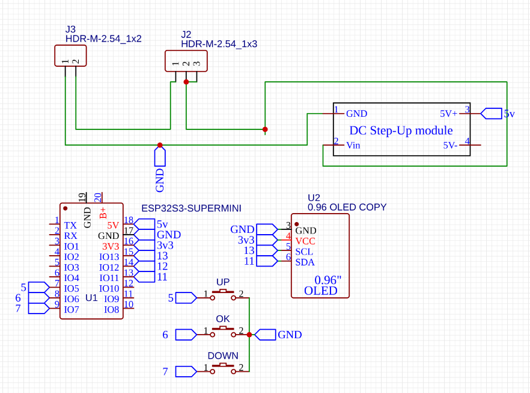
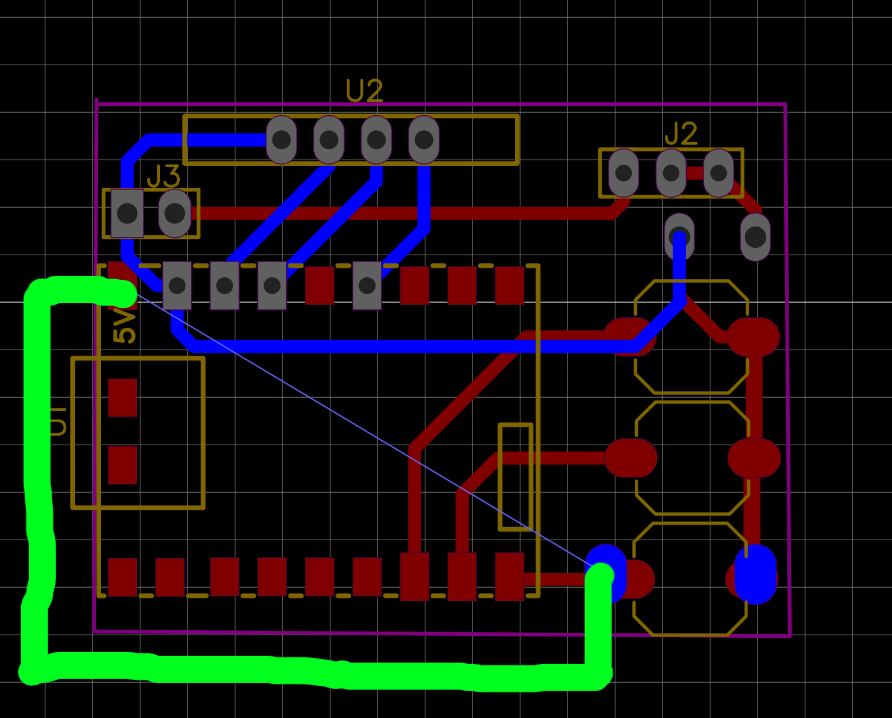

# 📟 Supermini-Reader 

**Карманная цифровая шпаргалка** на базе микроконтроллера ESP32-S3 SuperMini. С помощью этого устройства вы можете читать текст, загруженный через веб страницу 


---

### ⚠️ Дисклеймер
Создатель прошивки не несет ответственность за ваши действия. Если вас спалили я не виновен

*Использование прошивки означает ваше полное согласие с этими условиями*  

---
## Инструкция
**Кнопка вверх и вниз** - позволяют выбирать файл, листать страницы и регулировать яркостью (в Wifi режиме)

__Кнопка ОК__ - позволяет открывать/закрывать файлы, если зажать можно включить Wifi режим

### Как загрузить пошагово
1) Зажимаем кнопку ОК (ждем включение Wifi режима)
2) Открываем на телефоне, ПК Wifi сети и ищем точку доступа которая написана на экране
3) Кликаем и вводим пароль (тоже написано на экране)
4) На телефоне автомотически перекидывает на нужную веб страницу, на ПК открываем браузер и вводим IP (тоже написано на экране)
5) Вводим любой заголовок и текст (на русском или английском языке)
6) После загрузки зажимаем ОК на устройстве и нас перекидывает на главное меню, и там нас ждет загруженный файл

По умолчанию стоит такое имя сети и пароль (по желанию можно изменить, если пароль пустой то сеть будет открытой): 
``` cpp
const char* AP_SSID = "Esp hpora";
const char* AP_PASS = "12345678";
```
> [!WARNING]
> На IOS нельзя удалять файлы, только изменять содержимое файлов и загружать новые

---

| Компонент | Ссылка |
|-----------|--------|
| ESP32-S3 supermini | [AliExpress](https://ali.click/authk16) |
| OLED 0.96 | [AliExpress](https://ali.click/0sthk16) |
| Кнопки | [AliExpress](https://ali.click/zmthk1m) |
| Текстолит (двухсторонний) | [OZON](https://ozon.ru/t/EIpMMhm) |
| Преобразователь 5v,8v,9v,12v |[AliExpress](https://ali.click/431kk1u)|

 ---

#### Схема подключения

|Module|Pin 1|Pin 2|Pin 3|Pin 4|
|--------|--------|--------|--------|--------|
|**📺 Display**|VCC→3V3|GND→GND|SCL→G13|SDA→G11|
|**🔘 Buttons**|UP→G5|DOWN→G7|OK→G6|-|



---

### ❓ Как прошить ❓

Скачиваем три bin файла, затем переходим в Web загрузчик https://esptool.spacehuhn.com/ ,
загружаем, прописываем адреса как показано ниже


нажимаем "PROGRAM" т.е. загрузить и готово)

---
## Изготовление

> [!NOTE]
> Подробный гайд будет в конце сентября

Печатаем на глянцевой бумаге схему (в файле ЛУТ) **ВАЖНО РАЗМЕР 1 к 1** 

Более подробный и простой гайд от **AlexGyver про ЛУТ** 
[**You Tube**](https://youtu.be/NJTeIALlztI)

После успешного изготовление платы **ПРИМЕЧАНИЕ**, нужно припаять провод от преобразователя 5v как показано ниже и отпаять 2 резистора на преобразователе а именно A и B


