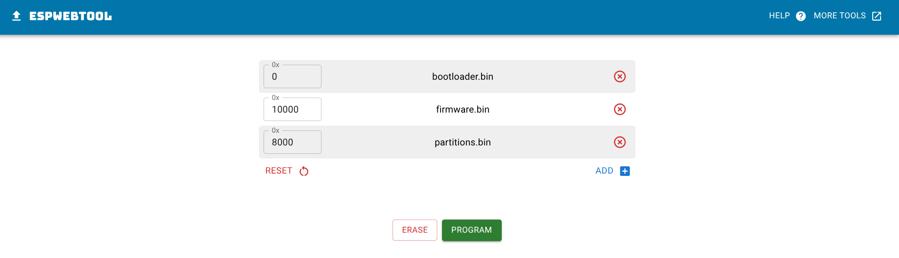

# 📟 Mini-Reader 

**Карманная цифровая шпаргалка** на базе микроконтроллера ESP32-S3 SuperMini. С помощью этого устройства вы можете читать текст загружаемый через веб страницу 

---

### ⚠️ Дисклеймер
Создатель прошивки не несет ответственность за ваши действия. Если вас спалили я не виновен

*Использование прошивки означает ваше полное согласие с этими условиями*  

---

| Компонент | Ссылка |
|-----------|--------|
| ESP32-S3 supermini | [AliExpress](https://ali.click/authk16) |
| OLED 0.96 | [AliExpress](https://ali.click/0sthk16) |
| Кнопки | [AliExpress](https://ali.click/zmthk1m) |
| Текстолит (двухсторонний) | [OZON](https://ozon.ru/t/EIpMMhm) |

 ---

#### Схема подключения

|Module|Pin 1|Pin 2|Pin 3|Pin 4|
|--------|--------|--------|--------|--------|
|**📺 Display**|VCC→3V3|GND→GND|SCL→G13|SDA→G11|
|**🔘 Buttons**|UP→G5|DOWN→G7|OK→G7|-|

---

### ❓ Как прошить ❓

Скачиваем три bin файла, затем переходим в Web загрузчик https://esptool.spacehuhn.com/ ,
загружаем, прописываем адреса как показано ниже

нажимаем "PROGRAM" т.е. загрузить и готово)

---
