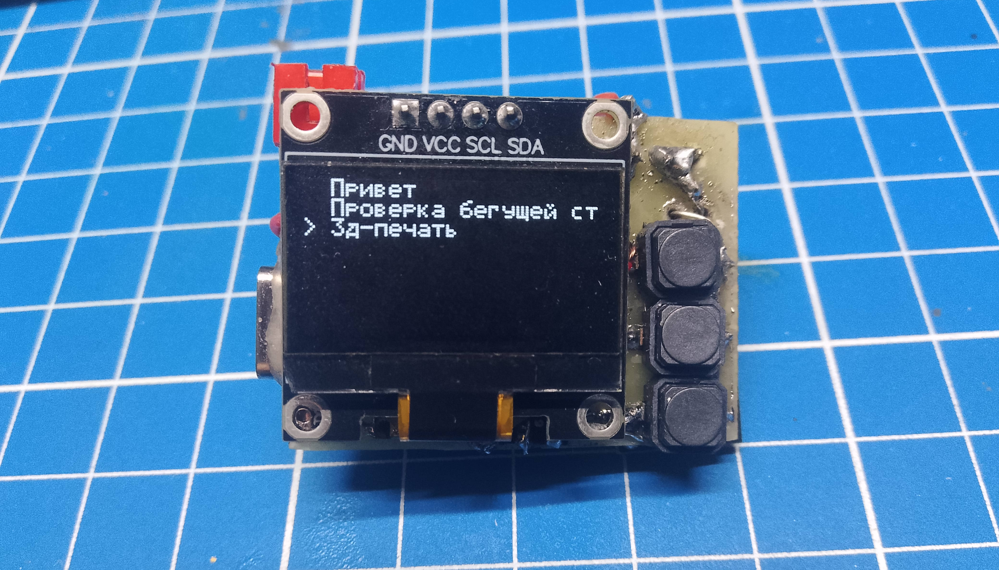
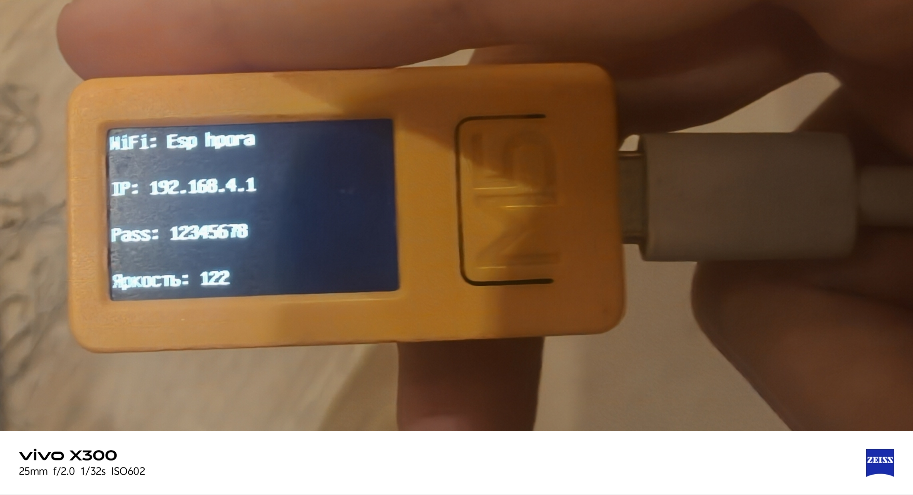

# 📟 Supermini-Reader 

**Карманная цифровая шпаргалка** на базе M5stickCP2. С помощью этого устройства вы можете читать текст, загруженный через веб страницу 




---

### ⚠️ Дисклеймер
Создатель прошивки не несет ответственность за ваши действия. Если вас спалили я не виновен

*Использование прошивки означает ваше полное согласие с этими условиями*  

есть баги к примеру первая буква на первой строке это рандом символ я их не исправил потому что закончились токены

И НЕ НАДО МНЕ ГОВОРИТЬ ЧТО Я НИЧЕГО НЕ МОГУ БЕЗ КЛОДА(так и есть)

---
## Инструкция
**Кнопка вверх и вниз** - позволяют выбирать файл, листать страницы и регулировать яркостью (в Wifi режиме)

__Кнопка ОК__ - позволяет открывать/закрывать файлы, если зажать можно включить Wifi режим, если в WiFi режиме один раз нажать ок то стик выключится

### Как загрузить пошагово
1) Зажимаем кнопку ОК (ждем включение Wifi режима)
2) Открываем на телефоне, ПК Wifi сети и ищем точку доступа которая написана на экране
3) Кликаем и вводим пароль (тоже написано на экране)
4) На телефоне автомотически перекидывает на нужную веб страницу, на ПК открываем браузер и вводим IP (тоже написано на экране)
5) Вводим любой заголовок и текст (на русском или английском языке) или загружаем файл
6) После загрузки зажимаем ОК на устройстве и нас перекидывает на главное меню, и там нас ждет загруженный файл

По умолчанию стоит такое имя сети и пароль (по желанию можно изменить, если пароль пустой то сеть будет открытой): 
``` cpp
const char* AP_SSID = "Esp hpora";
const char* AP_PASS = "12345678";
```
> [!WARNING]
> На IOS нельзя удалять файлы, только изменять содержимое файлов и загружать новые

---

### ❓ Как прошить ❓

Загружаем проект в platformIO из папки code и делаем Build, потом upload

---
